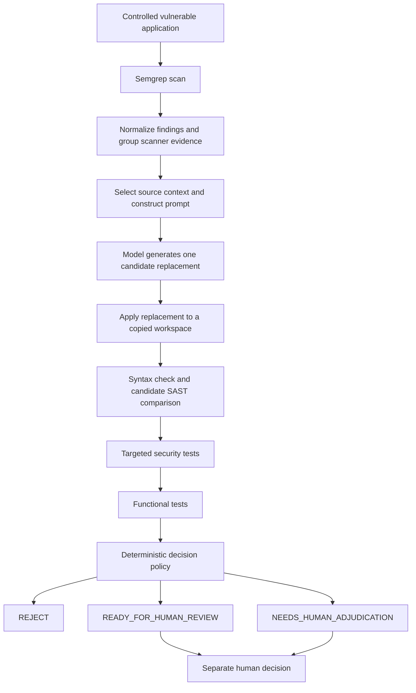

# Understanding and presenting FixProof

Updated September 5, 2026. Start with [current prototype status](prototype-status.md)
and [the primary review guide](primary-review-guide.md). The earlier
[alignment review](cs6727-alignment-review.md) records the initial assessment.
This is a working explanation
and preparation guide; adapt the wording to your understanding and the
current Canvas assignment before submission.

## Explain the project in one paragraph

FixProof evaluates whether an AI-generated security patch deserves human
review. It starts with a static-analysis finding in a controlled Express
application, asks a model to propose a focused repair, and applies that repair
to a copy of the application. Separate code then checks JavaScript syntax,
rescans the candidate, tries vulnerability-specific inputs, and checks normal
application behavior. A deterministic policy combines the results into a
rejection, readiness for human review, or a request to adjudicate conflicting
evidence. The saved patch, tests, findings, and decision explain how it reached
that result.

The research problem is that disappearance of a scanner warning alone gives
incomplete evidence of repair correctness. The intended users are developers
and security reviewers assessing generated patches. The project investigates
that problem through three controlled cases; it does not establish that every
generated web application can be fixed or certified secure.

## Follow one candidate through the system



1. **Scan.** Semgrep produces findings. A finding is a warning with a rule,
   source location, and metadata; it is not independently established ground
   truth.
2. **Normalize and correlate.** FixProof converts scanner-specific JSON into
   its schema and groups multiple rules pointing to the same local weakness.
   `FP-*` and `CF-*` identify records; their location-sensitive hashes are not
   sufficient for tracking a vulnerability across edits.
3. **Build context and prompt.** The context builder usually selects the
   enclosing Express route. The model receives that code, the finding, and
   repair constraints. Primary prompts withhold evaluator ground truth and
   test implementations.
4. **Generate.** `remediation_agent.py` asks the configured model for structured
   output: finding ID, analysis, repair strategy, replacement code,
   assumptions, and an additional-context flag. It checks the finding ID and
   saves the parsed response fields. It does not ask the model to grade the
   patch or give it general shell access.
5. **Apply to a copy.** The patch layer preserves the vulnerable baseline and
   writes a candidate application, diff, and workspace metadata. SHA-256
   hashes let a reviewer detect whether the recorded files have changed.
6. **Check independently.** `node --check` checks syntax. Semgrep rescans the
   candidate. Security validators test the supported exploit behaviors, while
   functional validators check benign behavior. For primary XSS, Chromium
   records whether the controlled JavaScript payload executes.
7. **Decide.** Python policy code combines the evidence. Concrete failed
   validation rejects a candidate; target resolution plus passing checks makes
   it ready for review; a persistent target plus passing runtime/functional
   checks requires adjudication. No automated state is a human approval.
8. **Retain the evidence.** JSON files preserve each stage. The pilot report
   and dashboard select evidence through their manifest. Primary-v1 has its
   own schedule, cases, collection state, verified report, and dashboard.
   The separate lifecycle ledger records new, persistent, resolved, and
   reopened findings across comparable source/scan snapshots.

An "independent validator" here means a separate implemented evaluation
channel outside the remediation model's grading authority. It does not mean
that different organizations authored the tests or that all tests are
statistically independent.

## Repository map

The filesystem serves as the prototype's evidence store. A database or a major
directory reorganization is not needed to explain the architecture. Preserve
bound experiment paths and make the entry documents easy to navigate.

```text
fixproof/
  README.md                       starting point and runnable commands
  IMPLEMENTATION_GUIDE.md          detailed historical implementation notes
  pyproject.toml                  Python package and direct dependency pins
  benchmarks/primary/v1/          frozen primary apps: xss, sqli, path-traversal
  sample_apps/                    pilot apps and an early Python scanner exercise
  rules/                          labeled supplemental SQLi Semgrep rule
  src/fixproof/                   Python implementation
    scan_pipeline.py             scanner preparation orchestration
    scanners/                    Semgrep execution and JSON parsing
    findings/                    scanner grouping and versioned lifecycle ledger
    agent/                       context, prompt, generation, retry prompt
    patches/                     candidate copying, replacement, and hashes
    validation/                  syntax, SAST comparison, runtime tests, policy
    evaluation/                  pilot/primary reports, human records, dashboard,
                                 and primary baseline verification
    primary_trials.py            frozen 15-attempt study collection
    demo.py                      disposable replay of selected pilot candidates
    reproduce.py                 pilot/primary evidence checks and automated tests
    config.py                    local model/key configuration
  data/                           experiment evidence (see table below)
  workspaces/                     curated pilot candidate copies and patches
  tests/                          automated implementation checks
  ui/                             read-only pilot and primary dashboards
  docs/                           design, methodology, results, and guides
  scripts/                        clean-extraction and archive utilities
  demo-test.ps1                   guided pilot demonstration
```

| Directory or file | What you should tell a reviewer |
|---|---|
| [benchmarks/primary/v1/](../benchmarks/primary/v1/) | These three versioned apps define the primary experiment. Each intentionally seeds one target weakness. |
| [sample_apps/](../sample_apps/) | These are development/pilot cases, including the early Python scanner exercise. The Python example does not establish a Python repair pipeline. |
| [data/evaluation/primary-benchmark-manifest.json](../data/evaluation/primary-benchmark-manifest.json) | This records the three cases, file hashes, ground-truth checks, and scanner expectations. |
| [data/evaluation/trial-plan.json](../data/evaluation/trial-plan.json) | This freezes trial count, model/prompt conditions, failure handling, and comparison rules. |
| [data/primary_trials/v1/](../data/primary_trials/v1/) | This contains the 15 primary attempts. Start with `collection-state.json`, then follow an individual case's `attempt.json` to its bound artifacts. |
| [data/ground_truth/](../data/ground_truth/) | These are evaluator-only pilot vulnerability descriptions, separate from scanner findings and remediation prompts. |
| `data/raw_scans/`, `normalized/`, `correlated/` | These show how raw pilot scanner findings become grouped FixProof evidence. Primary baseline scans are under `data/primary_baselines/`. |
| `data/contexts/`, `prompts/`, `retry_prompts/`, `remediations/` | These explain what the model received and returned in the pilot. Primary equivalents live in its preparation and case folders. |
| `data/validation/`, `security_validation/`, `functional_validation/`, `decisions/` | These contain separate pilot validation channels and their automated dispositions. |
| [data/adjudications/](../data/adjudications/) | These are the existing pilot evidence packets and human results. They do not establish that primary candidates have been reviewed. |
| [data/evaluation_controls/](../data/evaluation_controls/) | This is the deliberately constructed non-AI false-success control, excluded from AI-attempt rates. |
| [data/evaluation/experiment-manifest.json](../data/evaluation/experiment-manifest.json) | This selects the four pilot attempts and one control used by the existing report/dashboard. |
| [workspaces/](../workspaces/) | Curated pilot copies, diffs, and hashes preserve what was actually tested. Primary workspaces live beneath each primary attempt. |
| [data/primary_reviews/v1/](../data/primary_reviews/v1/) | Ten prepared conflict packets; actual human conclusions belong in separate result files. |
| [data/lifecycle/](../data/lifecycle/) | Recorded three-version SQLi replay demonstrates resolution and reopening; separate from the primary repair experiment. |
| [tests/](../tests/) | These test implementation behavior. A passing test count is not a count of repaired applications. |
| [ui/](../ui/) | `/ui/` presents the pilot; `/ui/primary.html` presents all 15 primary attempts with code, tests, and review status. |
| `.env`, `.venv/`, `node_modules/` | Local configuration and installed dependencies; excluded from version control and the tracked-file archive. |

Read the source in this order: [scan_pipeline.py](../src/fixproof/scan_pipeline.py),
[prompt_builder.py](../src/fixproof/agent/prompt_builder.py),
[remediation_agent.py](../src/fixproof/agent/remediation_agent.py),
[patch_workspace.py](../src/fixproof/patches/patch_workspace.py),
[validation_runner.py](../src/fixproof/validation/validation_runner.py),
[security_validator.py](../src/fixproof/validation/security_validator.py),
[functional_validator.py](../src/fixproof/validation/functional_validator.py),
[decision_engine.py](../src/fixproof/validation/decision_engine.py), then
[primary_trials.py](../src/fixproof/primary_trials.py).

## A concrete example to explain aloud

Use SQL injection to introduce the happy path:

- The original `/user` route inserts a request parameter into SQLite query
  text. A controlled tautology input can return additional fixture users.
- The model proposes a parameterized query, keeping the input value separate
  from the query structure.
- FixProof tests both the attack and legitimate lookups. The selected
  candidate passes these checks, and the labeled SQLi rule no longer reports
  the target.
- The disposition is `READY_FOR_HUMAN_REVIEW`. Explain the rule provenance:
  default scanning missed this target, and the benchmark uses a disclosed
  supplemental rule.

Then use pilot XSS attempt 1 to show why a passing security test is insufficient:
the patch's escaping logic groups adjacent special characters and corrupts
normal output. The recorded example changes `Tony &<> Alicia` into
`Tony undefined Alicia`. Functional tests detect that behavior and reject the
patch. The measured-feedback retry preserves the displayed text, but SAST
still flags the route, so the candidate goes to adjudication.

Finally show the separate non-AI static-output control for the precise
SAST-only false-success scenario. Explain its constructed origin before
showing the result. Do not present it as an extra generated AI attempt.

## Respond directly to the professor's feedback

| Professor's concern | Concrete explanation supported by this repository |
|---|---|
| "How will you create applications with a class of vulnerabilities?" | Purpose-built Express fixtures, one intentionally seeded target per primary app, fixed route/input/sink, synthetic data, locked dependencies, hashes, a baseline exploit that succeeds, and benign tests that pass. |
| "What exactly will the AI agent do?" | Receive one finding and focused context; return a structured replacement and assumptions. Tests, policy, scanner rules, and approval are outside its authority. |
| "Why these choices?" | Minimal fixtures make failure diagnosis and ground truth tractable. Three CWEs permit repeated complete evidence chains. One model and repeated initial prompts reduce treatment variation. Explain the lost realism and diversity. |
| "How is this systematic?" | A frozen protocol and fixed 15-slot schedule; same vulnerable start per case; withheld evaluator data; separate pilot/control sets; recorded failed/inconclusive handling and a stopping rule. |
| "How will you evaluate the solution rigorously?" | Compare the two interpretations on the same saved candidates; show denominators, full outcomes, disagreements, failures, and limitations. Report that the primary sample contains no false successes. |
| "What is your contribution?" | The implemented evidence pipeline, benchmark/oracle design, provenance and comparison work, decision policy, and empirical interpretation. Distinguish these from existing model repair and validation-feedback research. |

## Final paper outline

The syllabus requires a detailed account of the solution, efficacy, and
limitations. The following outline is a recommendation, not a mandated
template or page allocation. Obtain the actual page limit and format from
Canvas.

1. **Abstract.** Problem, controlled scope, method, primary sample size, actual
   findings, and the main limitation. State that no primary false success was
   observed.
2. **Problem and motivation.** Who makes the patch decision, why one validation
   signal is insufficient, the research question, and evidence from literature.
3. **Related work and contribution.** Compare prior repair/validation systems
   with explicit citations. Explain what the FixProof implementation and study
   add without a claim to be the first validation system.
4. **Scope and threat model.** Three Express CWEs; attacker-controlled endpoint
   inputs; assets and benign behavior; trust boundaries; excluded scenarios.
5. **Design and implementation.** Diagram, each stage's input/output, evidence
   schema, model authority, semantic comparison, deterministic policy, and
   human-review separation. Distinguish implemented features from plans.
6. **Experimental method.** Benchmark construction, independent ground truth,
   browser oracle, model/prompt settings, scanner version and rule origin,
   15 initial attempts, comparator, denominators, failure rules, and pilot
   separation. Explain limits of rulepack and model replay.
7. **Results.** Three separate tables for primary, pilot, and control. Include
   the 5/15 versus 10/15 primary disposition split, zero primary false
   successes, test outcomes, unique candidate counts, and actual human-review
   status. Mark inapplicable primary retry metrics accordingly.
8. **Discussion and limitations.** What evidence changed the decision; what the
   primary experiment did not demonstrate; narrow payload coverage; one app
   per CWE; custom-rule dependence; same-author benchmark/review bias; scope
   refinement; limitations of the new lifecycle matcher; deployment feasibility.
9. **Conclusion and future work.** Answer the research question at the level the
   evidence supports. Prioritize broader evaluation and stronger reproducibility
   before production features.
10. **References and appendices.** Artifact index, reproducibility commands,
    selected evidence examples, protocol changes, actual AI-use disclosure,
    and development prompt/export references. Check whether appendices count
    toward the assignment's page limit.

Write the paper as a reasoned account of the problem and evidence. A directory
listing can support the implementation section or appendix; it is not a
substitute for explaining why the design and results matter.

## Suggested 15-minute final presentation

OH1 29:15 describes a 15-minute final video. Confirm that duration against the
final assignment. This plan totals 15 minutes:

| Time | Topic | Material to show |
|---|---|---|
| 0:00–1:30 | Problem, affected reviewer, and research question | One concise motivation slide |
| 1:30–3:00 | Three-case scope and benchmark construction | Route/source/sink table; ground-truth procedure |
| 3:00–4:30 | Architecture and exact model authority | Pipeline diagram and structured response fields |
| 4:30–6:00 | Systematic experimental method | Fixed schedule; pilot/control/primary separation |
| 6:00–9:30 | Demonstration | SQLi candidate, XSS regression and retry, labeled control |
| 9:30–12:00 | Primary results and interpretation | 15-attempt table; 5 ready, 10 disagreements, 0 false successes |
| 12:00–13:30 | Limitations and deployment feasibility | Narrow cases/oracles; rules; copied workspaces; pending work if any |
| 13:30–15:00 | Contribution and reproducibility | Evidence links, checks, and what you learned |

Use saved evidence and a rehearsed bounded demo to keep the recording within
time. State which evidence is recorded and which stages were rerun live.
Screenshots or prerecorded clips should be labeled accordingly. Show the
primary study through `/ui/primary.html` and identify pilot examples explicitly.

For an early peer-facing progress video, OH1 discusses three to five minutes,
and OH2 describes roughly a three-minute pitch. Focus on the problem, concrete
scope, progress since the last report, a challenge, and the feedback you seek.
Do not reuse the entire final presentation for that short update.

## Commands for preparation and demonstration

Run from the repository root after the setup in
[reproducibility.md](reproducibility.md). Use the project interpreter: this
machine's default `python` is 3.9, while FixProof specifies Python 3.11.

```powershell
# Pilot and primary evidence verification and the test suite
.\.venv\Scripts\python.exe -m fixproof.reproduce --verify

# Frozen primary inputs and prompts; no model calls or new trial writes
.\.venv\Scripts\python.exe -m fixproof.primary_trials --dry-run

# Check the verified primary report without writing files
.\.venv\Scripts\python.exe -m fixproof.evaluation.primary_report --check

# Rehearse all four selected pilot candidates with live runtime checks
powershell.exe -ExecutionPolicy Bypass -File .\demo-test.ps1 -Suite

# A short pilot SQLi demonstration
.\.venv\Scripts\python.exe -m fixproof.demo --case sqli --validate

# Pilot XSS failure, followed by its recorded retry candidate
.\.venv\Scripts\python.exe -m fixproof.demo --case xss --attempt 1 --validate
.\.venv\Scripts\python.exe -m fixproof.demo --case xss --attempt 2 --validate

# Serve both dashboards; primary view is /ui/primary.html; stop with Ctrl+C
.\.venv\Scripts\python.exe -m fixproof.reproduce --serve
```

`--validate` reruns runtime security, functional checks, and the decision using
recorded candidate SAST. `--fresh-sast` also runs a new candidate syntax/Semgrep
check into disposable outputs; it may require network access and may differ
as default rules change. Neither demo mode requests a new AI candidate.
The full primary `--execute` runner is a study-collection operation, not a
presentation command. The initial 15-slot collection is already complete.

The primary baseline verifier's defaults write verification evidence used by
the frozen study. For any new post-collection validation, first inspect its
options and select new output paths; retain the original freeze evidence.

## Definition of ready to submit

- [ ] The report states the refined controlled-app/AI-repair scope and addresses
  the professor's benchmark, AI-role, justification, and evaluation concerns.
- [x] A primary results table verifies all 15 initial attempts and keeps pilot,
  retry, and non-AI controls separate.
- [ ] Ten primary conflict reviews are recorded, or the report explicitly
  identifies them as incomplete and limits its completion claims. Candidates
  ready for review are not described as automatically approved.
- [x] Reopened tracking is implemented separately from the frozen comparator,
  with tests and a labeled recorded replay.
- [ ] The submitted proposal/report explains the controlled application scope
  and actual application-generation provenance; it does not claim a broader
  AI-generated application corpus without evidence.
- [ ] The paper's claims match the observed outcomes, including zero primary
  false successes and limited candidate diversity.
- [ ] Every reference is checked and every AI-assisted contribution is
  disclosed with actual tool/prompt records where required. You have personally
  reviewed and can explain the work.
- [ ] A fresh environment restores dependencies, including primary apps and
  Chromium, and reproduces the intended checks with saved logs.
- [ ] The presentation has been rehearsed within the assignment duration; it
  distinguishes recorded evidence from live validation and pilot from primary.
- [ ] The intended repository snapshot contains all necessary primary and
  pilot artifacts, docs, rules, and lockfiles, with local credentials and
  installed environments excluded.
- [ ] The final paper and video satisfy the actual Canvas format, page/length
  limits, due dates, and upload requirements. Required peer feedback and
  progress submissions are complete.

After the intended final snapshot has been reviewed and committed, the
existing packaging workflow is:

```powershell
powershell.exe -ExecutionPolicy Bypass -File .\scripts\verify-clean.ps1
powershell.exe -ExecutionPolicy Bypass -File .\scripts\build-submission.ps1
```

These scripts require a clean working tree. They export committed files;
uncommitted documentation will not be included. The default clean check uses
the current Python environment; use the documented installation procedure for
the stronger fresh-environment claim. Review the ZIP contents, include or
separately attach the paper/video as Canvas specifies, and retain submission
receipts. No submission or instructor communication was performed by this
review.
