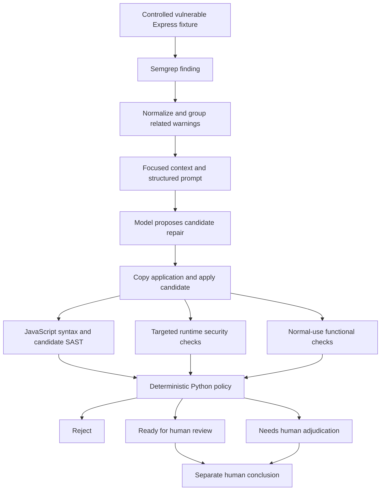

# Understanding, demonstrating, and defending FixProof

Evidence checked September 10, 2026. This guide explains the implementation,
demonstration, literature, and likely professor questions. It is a learning
guide, not a claim of instructor approval or complete application security.

## A short explanation to practice

FixProof helps a reviewer decide whether an AI-generated security patch has
enough supporting evidence. It starts with a scanner finding in a deliberately
vulnerable Express application, asks a model for a focused repair, and tests
the candidate in a copy of the application. Static analysis, attack-oriented
tests, and normal-use tests produce separate evidence. Python policy rejects
failed or inconclusive validation, recommends review when checks agree, or
escalates static/runtime disagreement. The reviewer sees the patch and results
and records a separate conclusion.

The motivating problem is accepting a patch based on too little evidence.
The project investigates this problem in three controlled cases; it is not a
general autonomous security auditor or a production deployment service.

## Terms and responsibilities

| Term | Meaning in FixProof |
|---|---|
| SAST | Static Application Security Testing: scanner analysis of source code without executing the application |
| Finding | A rule-generated warning; it is not independently established vulnerability ground truth |
| CWE | A category of software weakness, such as reflected XSS, SQL injection, or path traversal |
| Candidate | A proposed source-code repair, not an approved fix |
| Oracle | The implemented criterion that decides whether an observed response satisfies a test's expected behavior |
| Functional regression | A patch changes intended normal behavior, even if an attack no longer works |
| Adjudication | Human investigation of conflicting evidence, with a recorded verdict and rationale |
| Evidence verification | Consistency and hash checks of saved artifacts; different from executing a new scan or experiment |



The runtime remediation model receives one finding, focused application code,
and repair constraints. It returns structured repair fields and replacement
code. It does not receive evaluator test implementations or their ground-truth
answers, run an unrestricted shell, grade its patch, or sign reviewer results.

Python validators start the copied Node application on loopback, issue HTTP
requests, collect observations, and compare them with predefined expectations.
Chromium checks controlled XSS execution. Tests and policy are implemented
outside the remediation model's grading authority. This is operational
separation, not independent authorship: disclose ChatGPT/Codex assistance in
developing the benchmark, code, tests, and documentation. Same-author design
and review remain possible sources of bias.

## The three cases

| Case | Deliberate baseline weakness | Security observation | Normal-use observation |
|---|---|---|---|
| XSS / CWE-79 | `/hello?name=...` reflects input into HTML | Fixed markup/script payloads; current validator examines reflected output and Chromium execution | Names, spaces, ampersands, quotes, and adjacent markup characters preserve their intended displayed text |
| SQLi / CWE-89 | `/user?username=...` incorporates input into a SQLite query | A controlled tautology input must not return unauthorized fixture users; a legitimate lookup is a control | Known users return the expected rows and an unknown user returns none |
| Traversal / CWE-22 | `/file?name=...` lets input influence a filesystem path | `../outside-secret.txt` must not reveal the controlled outside-file marker; a legitimate file is a control | Expected public files remain readable and missing-file behavior remains correct |

The fixtures use synthetic data. Minimal applications make expected behavior
and vulnerability ground truth tractable. Broader public applications would
improve realism but introduce more routes, dependencies, and ambiguous test
expectations. The current scope trades realism for a complete evidence chain.

SQLi uses a disclosed local rule because the default scanner configuration
missed its target. This is a limitation and design choice to explain, not a
measurement that Semgrep detects all SQL injection. The saved default miss
and controlled-rule provenance remain separate evidence.

## Understand the decisions

| Condition | Disposition | What it means |
|---|---|---|
| Syntax fails, new SAST findings appear, or security/functional status is not pass | REJECT | The candidate is not eligible for approval under the selected checks; inconclusive security evidence also prevents readiness |
| Target resolves and all selected checks pass with no new findings | READY_FOR_HUMAN_REVIEW | The automated evidence agrees; this is not human approval |
| Target persists but security/functional checks pass with no new findings | NEEDS_HUMAN_ADJUDICATION | A reviewer must investigate the discrepancy; passing tests alone do not prove the warning false |

The policy is explicit code, not a model's opinion. A test set can pass by
correctly rejecting a bad candidate. More approvals are not inherently a
better research result.

An observed false success means SAST suggests success while downstream
evidence does not support it. Be precise about which evidence set demonstrates
that situation. The initial pilot XSS failure is a functional regression but
not a SAST false success, because its target warning persisted.

## The evidence sets and what they support

| Set | Current observations | Interpretation |
|---|---|---|
| Pilot | Four AI attempts, including one XSS retry; one reject, one ready, two selected disagreements | Feasibility and concrete functional-regression/retry examples |
| Separate non-AI control | Static-output XSS candidate clears the target but fails downstream checks | Exercises the false-success policy branch; excluded from AI rates |
| Primary-v1 | 15 initial attempts: five per CWE; five ready, ten disagreements; all targeted security and functional aggregates pass | Repeated descriptive evidence on three fixtures |
| Human review | Two XSS acceptances recorded; eight disagreements pending | Separate reviewer conclusions, not changes to primary automated outcomes |
| Lifecycle replay | Saved vulnerable SQLi baseline, saved fixed candidate, then baseline reintroduced | Demonstrates new/resolved/reopened tracking; not new repair trials |

Primary target resolution is 5/15 (33.3%); disagreement is 10/15 (66.7%).
There are zero observed primary SAST false successes and zero new primary
SAST findings. Do not call this a 100% repair success rate. The 15 distinct
model response IDs produced 11 distinct source hashes; all five SQLi calls
produced the same source. Fifteen calls are not fifteen independent apps.

The original research question about bad patches that clear SAST remains only
partially addressed: the primary sample contains none. The control verifies a
policy behavior, while the pilot shows functional-regression rejection.
Supplemental evaluation can strengthen coverage, but must not rewrite the
primary study or select only favorable outcomes.

## Demo commands and speaking notes

Run from the repository root using the existing project environment. No human
approval is required to demonstrate validation.

```powershell
# Full evidence/test check plus four live pilot candidate validations
powershell.exe -ExecutionPolicy Bypass -File .\demo-test.ps1 -Suite

# Start the verified dashboard; stop the server with Ctrl+C
.\.venv\Scripts\python.exe -m fixproof.reproduce --serve
```

The most recent full suite passed 89 tests on September 10. Unit/integration
test counts describe implementation checks, not numbers of repaired apps.
The four demo cases reproduced expected decisions in the retained demo logs.

Open `http://127.0.0.1:8080/ui/primary.html` for primary results, or `/ui/` for
the pilot and non-AI control. A dashboard selection shows recorded evidence;
refreshing the page does not run tests or record approval.

For a focused walkthrough, use these commands individually:

```powershell
.\.venv\Scripts\python.exe -m fixproof.demo --case sqli --validate
.\.venv\Scripts\python.exe -m fixproof.demo --case xss --attempt 1 --validate
.\.venv\Scripts\python.exe -m fixproof.demo --case xss --attempt 2 --validate
.\.venv\Scripts\python.exe -m fixproof.demo --case path-traversal --validate
```

1. Show SQLi first: the candidate parameterizes the query, preserves legitimate
   lookups, and is ready for review.
2. Show pilot XSS attempt 1: `Tony &<> Alicia` becomes `Tony undefined Alicia`.
   Two functional checks fail, so rejection is the expected successful demo.
3. Show pilot XSS attempt 2: six functional checks pass, while the recorded
   SAST finding persists. Explain why adjudication is required.
4. Show primary results separately: five ready, ten disagreements, no primary
   false success. Do not treat the pilot retry as another primary trial.
5. Open one primary evidence row and show source, diff, scanner rules, security
   observations, functional observations, and the separate human record.

Default demos reuse saved model candidates and candidate SAST. Runtime tests
and policy recomputation run live in disposable directories. Current live XSS
validation uses Chromium; early saved pilot XSS security artifacts used
reflected-output checks. Label historical and newly rerun evidence accurately.

To include a new candidate syntax/Semgrep scan in a disposable demo:

```powershell
powershell.exe -ExecutionPolicy Bypass -File .\demo-test.ps1 -Case sqli -FreshSast
```

This may require network access, and changed remote rules may change results.
It still does not request a new AI patch. Do not rerun the frozen primary
collector or baseline verifier with their default output paths for a demo.

To demonstrate recorded lifecycle history:

```powershell
.\.venv\Scripts\python.exe -m fixproof.findings.lifecycle --history data/lifecycle/sqli-recorded-replay.json --check
```

Explain that comparable snapshots use the same declared ruleset, scanner
version, and scanned-file coverage. Identity uses relative file, CWE, and
Express scope; ambiguous findings are rejected. It is a controlled matcher,
not a general semantic identity solution.

## Human review

The UI is read-only. Use [the review guide](primary-review-guide.md) and the
CLI's `--rationale-file` option for quote-containing text. A verdict must be
your own conclusion after inspecting all required evidence groups. Acceptance
does not deploy the candidate or alter the automated decision. Additional
testing can be requested instead of acceptance.

For a useful rationale, explain the relevant patch change, why the rule still
matches, what the security observations establish, what normal behavior was
checked, and what remains outside the evidence. The two existing written
rationales primarily describe encoding; fuller analysis can be retained in a
dated supplement without overwriting the signed results.

## Files to show when asked how it works

| Professor's question | Evidence or code to open |
|---|---|
| What are the apps and expected behaviors? | `benchmarks/primary/v1/`, `data/evaluation/primary-benchmark-manifest.json` |
| What does the AI receive and return? | `src/fixproof/agent/` and the selected primary preparation/response artifacts |
| How are tests executed? | `src/fixproof/validation/security_validator.py`, `functional_validator.py`, `browser_xss.py` |
| Who decides whether a patch passes? | `src/fixproof/validation/decision_engine.py` |
| How was the experiment fixed in advance? | `docs/study-protocol-v1.md`, `data/evaluation/trial-plan.json` |
| Where are the 15 results? | `docs/primary-results.md`, `data/primary_trials/v1/` |
| Where is human approval recorded? | `data/primary_reviews/v1/`; it is separate from the automated decisions |
| What demonstrates reopening? | `src/fixproof/findings/lifecycle.py`, `data/lifecycle/sqli-recorded-replay.json` |
| Can the work be reproduced? | `docs/reproducibility.md`, verification logs, and archive scripts |

Copied workspaces are not hardened sandboxes. Syntax checking is `node --check`,
not a full application build. Hashes detect inconsistencies but do not prove
authenticity if someone replaces evidence and its hashes together. Remote auto
rules were not fully archived; exact new-scan replay is limited. These limits
are appropriate to state directly.

## How the references support the project

The three research papers form a reasonable foundation for Progress Report 2.
The supplied rubric gives no minimum reference count. Citation count alone
cannot establish rigor; each source should support a specific claim or design
comparison. The updated draft adds two technical references where useful.

| Source | Supported point | Use and limit |
|---|---|---|
| [Pearce et al., Asleep at the Keyboard?](https://arxiv.org/abs/2108.09293) | Generated code contained vulnerabilities in the authors' selected scenarios | Motivation; its reported rate is not a rate for current models or FixProof |
| [Pearce et al., Examining Zero-Shot Vulnerability Repair](https://arxiv.org/abs/2112.02125) | Studies LLM repair and describes difficulty obtaining functionally correct repairs in real-world examples | Related repair work; supports evaluating correctness beyond a proposed change |
| [Kulsum et al., VRpilot](https://arxiv.org/abs/2405.15690) | Uses reasoning and external validation feedback to refine patch generation | Compare feedback/retry design; FixProof cannot claim to invent that technique or outperform it without a matched experiment |
| [OWASP Web Security Testing Guide v4.2](https://wstg.owasp.org/v4.2/) | Advocates systematic testing and recognizes that testing is not exhaustive | Supports supplemental test planning; not certification that FixProof meets the whole guide |
| [Semgrep, Run rules](https://docs.semgrep.dev/running-rules) | Documents rule configuration and use of registry/local configurations | Supports scanner provenance explanation; does not prove benchmark detection accuracy |

For supplemental tests, consult the specific OWASP chapters on
[reflected XSS](https://wstg.owasp.org/v4.2/4-Web_Application_Security_Testing/07-Input_Validation_Testing/01-Testing_for_Reflected_Cross_Site_Scripting/),
[SQL injection](https://wstg.owasp.org/v4.2/4-Web_Application_Security_Testing/07-Input_Validation_Testing/05-Testing_for_SQL_Injection/), and
[directory traversal](https://wstg.owasp.org/v4.2/4-Web_Application_Security_Testing/05-Authorization_Testing/01-Testing_Directory_Traversal_File_Include/).
Map each proposed test to an applicable input vector, expected attack outcome,
and normal-use control. Guidance should inform new tests; do not retroactively
claim it was the documented origin of every existing payload.

For the final paper, expand related work when a comparison is missing: patch
correctness/overfitting, another closely related repair system, and realistic
benchmark design are useful areas to investigate. Read the methods and
limitations, not just abstracts. Use the cited version consistently: Report 2
uses the 2021 arXiv preprints for the Pearce papers; other repository notes
refer to their 2022 and 2023 conference publications. Those are different
versions of the same works, not extra independent studies.

External references motivate and contextualize FixProof. Your own artifacts
support its result counts. No external paper establishes that FixProof's
candidates are correct, that its reviews are complete, or that the professor
has accepted the scope.

## Answering the original feedback

| Concern | Concrete response | Remaining qualification |
|---|---|---|
| Scope unclear | Three Express fixtures, one intended target weakness per fixture, five initial calls each | Not a representative AI-generated application corpus |
| How are vulnerable apps created? | Deliberately seeded route/input/sink with synthetic data, independent vulnerable baseline behavior, and benign controls | Application diversity is limited |
| What exactly does the agent do? | Focused structured repair generation; recorded response and bounded candidate application | Validators and human verdicts are outside its authority |
| Approach seems ad hoc | Frozen protocol, fixed schedule, separate evaluator data, comparable candidate interpretations, retained outcomes | Any post-collection work is labeled separately |
| Consider options and justify choices | Minimal vs. large apps; three CWEs vs. broader coverage; fixed model; disclosed custom rule; limited retry | Explain tradeoffs rather than claim the chosen option is universally best |
| Rigorous evaluation | Fixed denominators, full result matrix, pilot/control separation, real human records, reproducibility checks | Zero primary false successes, repeated apps, incomplete reviews, and limited test coverage |

The defensible contribution is the implemented evidence pipeline, controlled
benchmark/oracle design, deterministic review policy, provenance work, and
empirical analysis. The current material responds concretely to the feedback;
only the instructor can decide whether the refined scope meets expectations.

## What to finish next

Complete eight reviews and retain fuller explanations. Define and run a small
supplemental test set without changing primary-v1. Develop the related-work
comparison, methods/results narrative, and limitations. Rehearse the demo and
prepare the final report/presentation and committed package. The narrow core
prototype is close to feature completion; research interpretation and course
deliverables remain. Actual reporting dates/hours are still needed to finalize
Progress Report 2.
